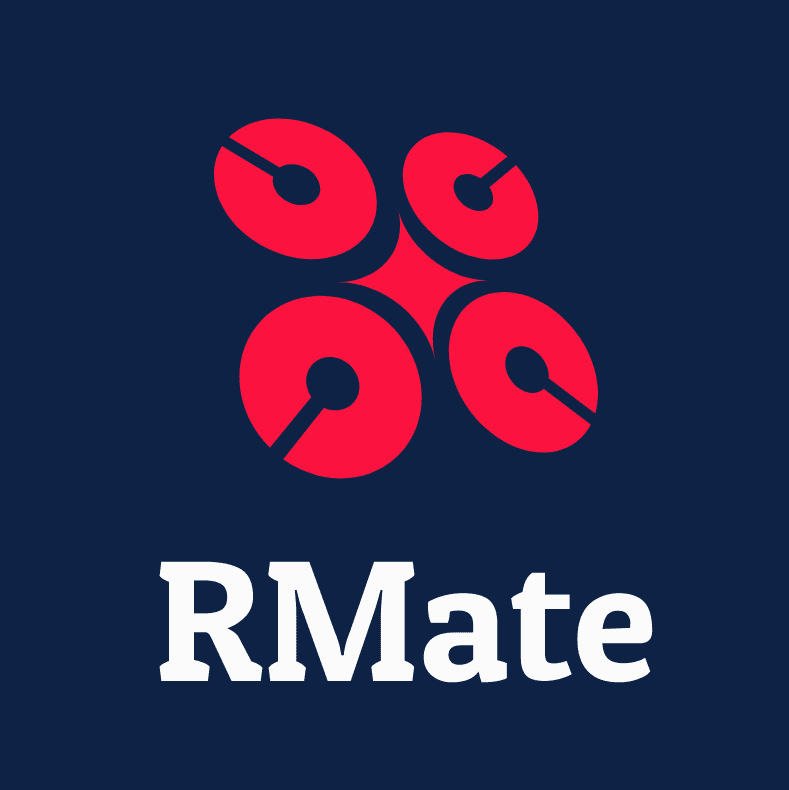

# アプリケーション名	
## RMate

# アプリケーション概要
### アプリケーションロゴ

### アプリ名の由来
- #### 1RMを伸ばしていく事をサポートするアプリにしたいという思い
トレーニング記録の単位の１つに「RM」というものがあります。  
これはその種目においてその人が1回持ち上げられる最大の重量を指す単位です。(例えばベンチプレスで60kg10回が限界の人のベンチプレスの1RMは75kg)  
このRMを伸ばすためのサポートをしたいという思いから命名しました。
- #### ユーザー同士でトレーニング情報やメニューを共有できる場にしたいという思い
まだ未実装ではありますが、このアプリの最終的な目標はトレーニー同士のコミュニティの場になる事です。  
トレーニングは基本的には1人で黙々と行うものです。その中でこのアプリを利用する人同士が繋がりを持ち、日々のトレーニングのモチベーションにも繋げてほしいという思いから「仲間」を意味するMateを付けました。

### デザインコンセプト
年齢、性別問わず広く利用していただきたいという思いから、極力余計な情報の無い無機質なものにしました。  
また、トレーニング開始ボタンや記録詳細画面へのリンクのアイコン等は、直感的に押したくなるようなサイズ感とデザインになるよう意識しました。

### どんなアプリ？
トレーニングを趣味にしている方、今後トレーニングを始めようとしている方に向けたトレーニング記録アプリです。  
### できること
- #### トレーニング記録
トレーニングを部位別に記録でき、日付・種目名・使用重量・rep数・最大1RMを記録できます。  
また、詳細画面において日付ごとに記録したトレーニングを閲覧することができます。
- #### ユーザー管理
アプリを利用する際にユーザー登録ができます。  
登録したユーザー情報は詳細画面から編集でき、アイコン画像・ニックネーム・Email・Password・生年月日・トレーニング歴・目標・自己紹介・身長・体重を設定できます。

### アピールポイント
- #### RM自動計算機能
重量とrep数を入力すると自動的に1RM(1回挙げることができる最大の重量)を計算してくれます。  
- #### ストップウォッチ機能
記録画面にストップウォッチ機能を搭載し、休憩時間やトレーニング時間を測ることができる仕様になっています。  
- #### ユーザー情報編集機能
ユーザー管理機能ではアイコン画像を設定でき、ユーザーが自分自身でプロフィール情報を自由に設定できます。

# 本番環境
URL:[RMate](http://18.177.171.145)

BASIC認証
- ID admin
- Pass 2222

ログイン情報（テスト用）
- Eメール :sample@mail.com
- パスワード testtest
# 制作背景（意図）
# DEMO
# 工夫した点
# 使用技術
# 課題・今後実装したい機能

# テーブル設計

## users テーブル

| Column     | Type   | Options     |
| ---------- | ------ | ----------- |
| nickname   | string | null: false |
| email      | string | null: false |
| password   | string | null: false |
| birth_date | date   |             |
| career     | string |             |
| aim        | text   |             |
| introduction | text   |             |
| height     | integer|             |
| weight     | integer|             |
| image     | string|             |

### Association
- has_many :menus

## menus テーブル

| Column       | Type       | Options     |
| ------------ | ---------- | ----------- |
| training_date| date       | null: false |
| part         | string     | null: false |
| training     | string     | null: false |
| weight       | integer    |             |
| rep          | integer    | null: false |
| rm           | integer    |             |
| user         | references |             |

### Association
- belongs_to :user